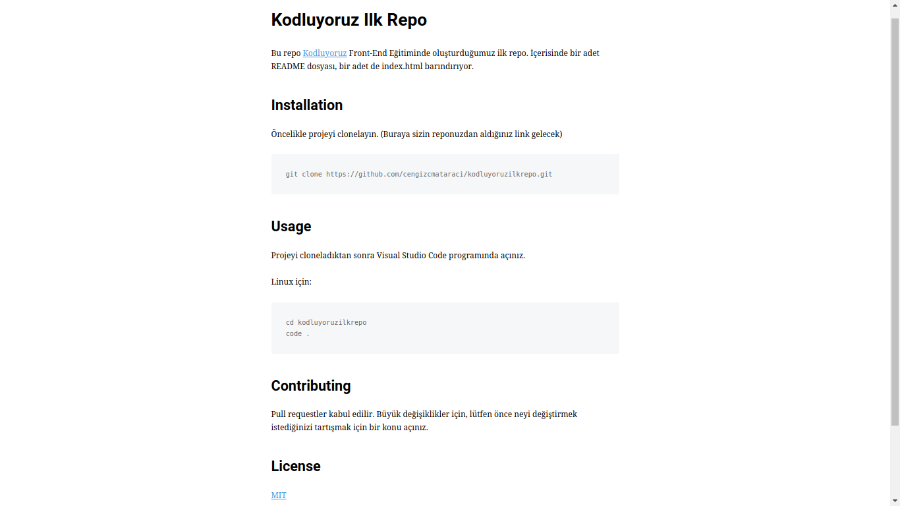

# kodluyoruzilkrepo\
Bu repo [link][kodluyoruz] FrontEnd Eğitiminde oluşturduğumuz ilk repo içerisinde bir adet\ 
README bir adet de index.html barındırıyor.\

## Installation\

Öncelikle projeyi clonlayın.

git clone https://github.com/auyar48/kodluyoruzilkrepo.git 

## Usage

Projeyi clonladıktan sonra Visual Studio Code programında açınız.

Linux için:

 cd kodluyoruzilkrepo
 code

## Contributing

Pull requestler kabul edilir. Büyük değişikler için. lütfen önce neyi değiştirmek istediğinizi tartışmak için bir konu açınız.

## Lisans

MIT

Kodluyoruz Eğitimi kapsamında açtığım ilk repo
